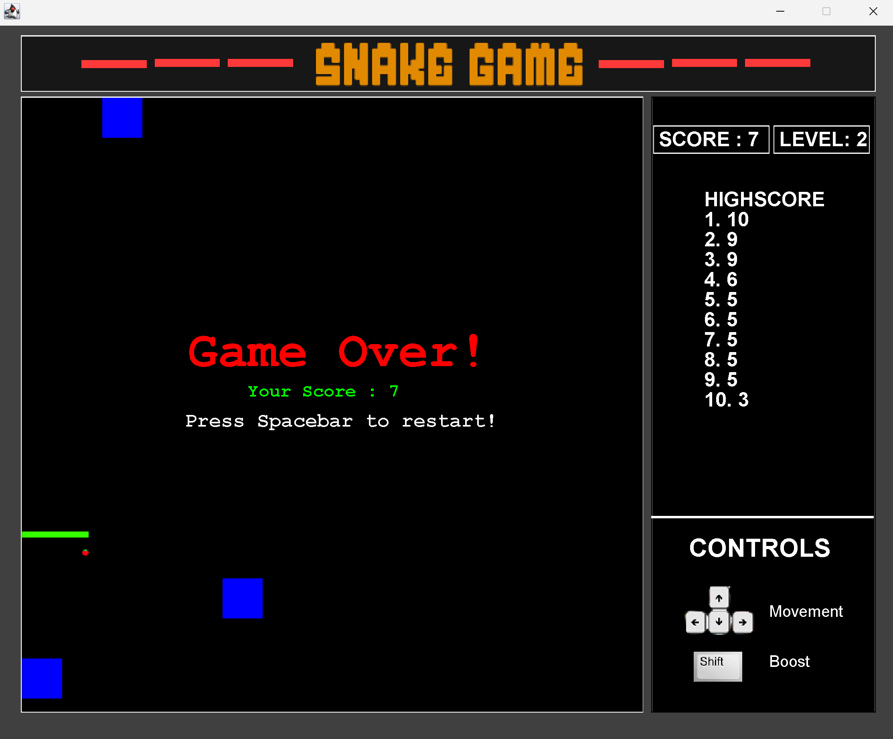
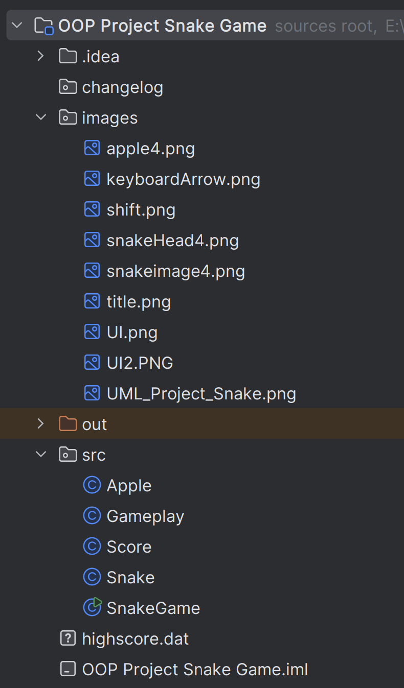

# Java Snake Game using Swing
A classic Snake game implemented in Java using Swing for GUI rendering and AWT for event handling. This project showcases object-oriented design with modular code, interactive gameplay, dynamic levels, hurdles, and a persistent high score leaderboard.

After every 5 points the level increases and three hurdles are inserted at random coordinates. The scores of each try are written into the bat file and are read from them to be displayed onto the scoreboard.

##  OOP Concepts Used
Encapsulation: Game logic separated into classes (e.g., Snake, Apple, Score)

Inheritance: Custom behavior through JPanel, KeyListener, and ActionListener

Abstraction: Abstracting UI rendering and event handling logic

Modularity: Clear separation of rendering, logic, and data

## Folder Structure

